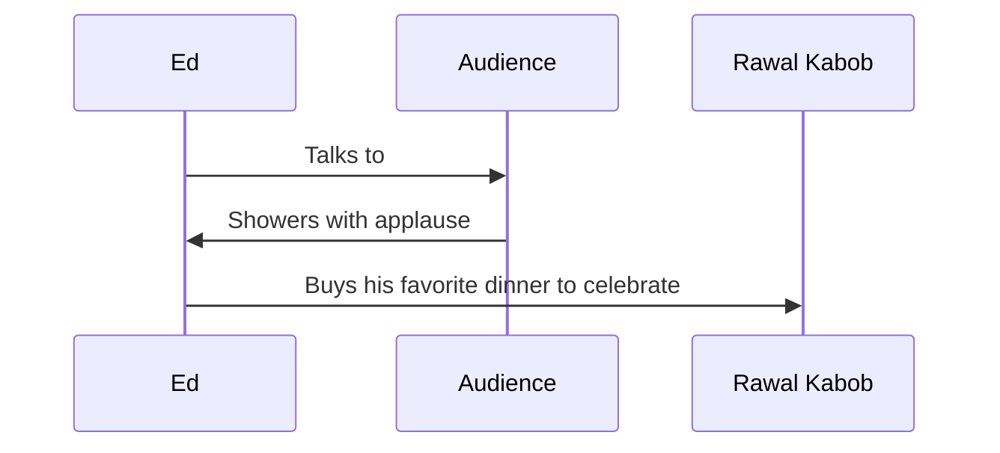

You can make diagrams with Mermaid^[[mermaid](https://mermaid.js.org/)]

```mermaid
sequenceDiagram
	Ed->>Audience: Talks to
	Audience->>Ed: Showers with applause
	Ed->>Rawal Kabob: Buys his favorite dinner to celebrate
```

[[Mathjax|previous]] [[Tasks plugin|next]]